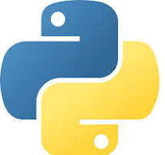

# Arjun Suresh Kumar

## Programming

I am a student at UCSD with a few programming projects, mostly in _Python_ and _Java_.




Here is some code I wrote in Python:

```convolution = [
	0, 0, 0, 0, 0,
	0, 0, 0, 0, 0,
	0, 0, 0.843137, 0.8, 0.337255,
	0, 0, 0.74902, 0.74902, 0.87451,
	0, 0, 0.211765, 0.0941177, 0.301961
]

mask = [
	0.001684,  0.023944,  0.035662,  0.004637,  0.001945,  
	0.034761,  0.030464,  0.037037,  0.00225,   0.030251, 
	0.010207,  0.025616,  0.033486,  0.024188,  0.037933,
	0.011647,  0.004154,  0.030549,  0.002482,  0.014212,
	0.005002,  0.011376,  0.008008,  0.024042,  0.033993,
]

print(sum([convolution[i] * mask[i] for i in range(25)]))
```

Some people may think new languages like __Rust__ are more suitable to all projects, but as Linus Torvalds says: 

>"I'm interested in the project, but I think it's driven by people who are very excited about Rust, and I want to see how it actually then ends up working in practice."

[Source for quote](https://arstechnica.com/gadgets/2021/03/linus-torvalds-weighs-in-on-rust-language-in-the-linux-kernel/)

In order my favorite classes at UCSD have been:

1. CSE160
2. CSE106
3. CSE105

Some classes I still want to take are:

- [ ] CSE131
- [ ] CSE167

## Other

In my free time I like to:

- draw
- play the piano
- play video games

[a drawing i made](rick.md)

[Back to Top](#Programming)